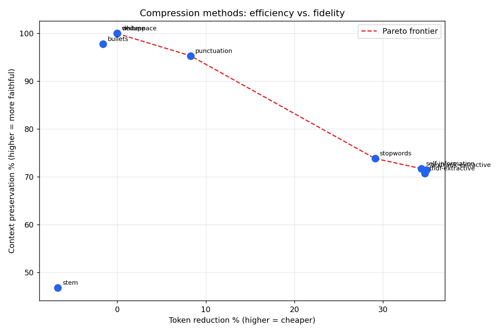
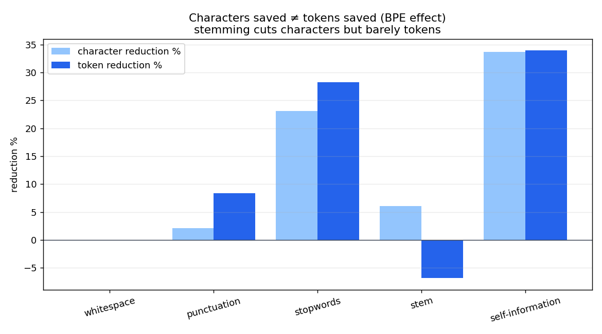

# context-compression-lab

[](https://github.com/marc-albert-global/context-compression-lab/actions/workflows/ci.yml)


A benchmark lab for **token minimization**: run many text-compression methods
over a corpus and measure, as percentages, how much each one **reduces tokens**
versus how much **context it preserves**. An ongoing, pluggable research project
- covering classic NLP preprocessing, syntactic and statistical filtering,
format rewriting, and (optionally) a SOTA learned compressor and an LLM rewriter.

The companion [**LITERATURE.md**](LITERATURE.md) surveys the whole field
(LLMLingua, SelectiveContext, gist tokens, ICAE, xRAG, …) with each method's
methodology and citation.

---

## Headline results

Corpus: 30 SQuAD passages. Tokenizer: real BPE (`tiktoken/cl100k_base`).
"Preservation" = mean of entity retention and ROUGE-L.

| Method | Category | Token ↓ % | Preservation % | Entities % |
|---|---|--:|--:|--:|
| `textrank-extractive` | extractive | **34.9** | 71.4 | 66.6 |
| `tfidf-extractive` | extractive | 34.7 | 70.7 | 63.5 |
| `self-information` | info-theoretic | 34.3 | 71.7 | 71.9 |
| `stopwords` | lexical filtering | 29.1 | 73.8 | 72.6 |
| `punctuation` | normalization | 8.3 | **95.3** | 93.3 |
| `bullets` | format rewrite | -1.6 | 97.8 | 95.9 |
| `stem` | normalization | **-6.7** | 46.7 | 13.5 |

Two findings jump out:

**1. The efficiency/fidelity frontier.** Extractive methods buy ~35% token
savings at ~71% preservation; stopword removal is a touch safer; punctuation
stripping is a near-free 8% with 95% preservation. The Pareto frontier makes
the trade-off explicit:



**2. Stemming backfires.** Aggressive stemming *increases* token count (-6.7%
"reduction") and shreds entities (13.5% retained), because normalizing word
forms produces strings the BPE merges don't cover, which fragment into *more*
tokens. Characters saved ≠ tokens saved:



> A caveat the lab is built to surface: **semantic similarity does not
> guarantee downstream task accuracy** (see LITERATURE.md). That's why an
> optional LLM task-eval measures whether a model can still *answer questions*
> from the compressed text, the only test that catches the gap.

---

## Quickstart

```bash
git clone https://github.com/marc-albert-global/context-compression-lab.git
cd context-compression-lab
python3 -m venv .venv && source .venv/bin/activate
pip install -e ".[dev]"

ccl methods                                  # list compressors + availability
ccl compress -m stopwords "The cat sat on the mat in the warm afternoon sun."
ccl bench                                    # full benchmark → reports/ + figures
pytest -q                                    # 9 tests, offline
```

`ccl compress` shows the before/after token count and preservation for any
method; `ccl bench` regenerates `reports/results.md`, `results.csv`, and both
figures from the committed corpus.

### Optional layers

```bash
pip install -e ".[embed]"      # adds embedding-cosine preservation metric
ccl bench --embedding

pip install -e ".[llmlingua]"  # adds Microsoft LLMLingua-2 as a comparator
pip install -e ".[llm]" && export ANTHROPIC_API_KEY=sk-ant-...
ccl bench --llm-eval           # adds true downstream task-accuracy (Claude answers QA)
```

## Add a method (the "continuous research" part)

A compressor is one class and one decorator; it then appears in `ccl methods`
and the benchmark automatically:

```python
from ccl.compressors.base import Compressor, register

@register
class DropVowels(Compressor):
    name = "drop-vowels"
    category = "lexical/experimental"
    def compress(self, text: str) -> str:
        return "".join(c for c in text if c.lower() not in "aeiou")
```

## How it's organized

```
src/ccl/
├── tokenization.py     real BPE counter (tiktoken) + offline regex fallback
├── compressors/        lexical · syntactic · extractive · formats · external(optional)
│   └── base.py         Compressor protocol + @register registry
├── metrics.py          token reduction, entity retention, ROUGE-L, Jaccard, embedding*
├── eval_llm.py         optional: Claude QA accuracy from compressed vs full context
├── benchmark.py        run all registered methods over the corpus
└── report.py           markdown table + Pareto and BPE figures
```

## Data

30 passage+question+answer items sampled from SQuAD v1.1 dev (CC BY-SA 4.0),
committed for offline reproducibility. Provenance in [`data/README.md`](data/README.md).

## License

MIT © 2026 Marc Albert. Bundled data © its original authors under CC BY-SA 4.0.
